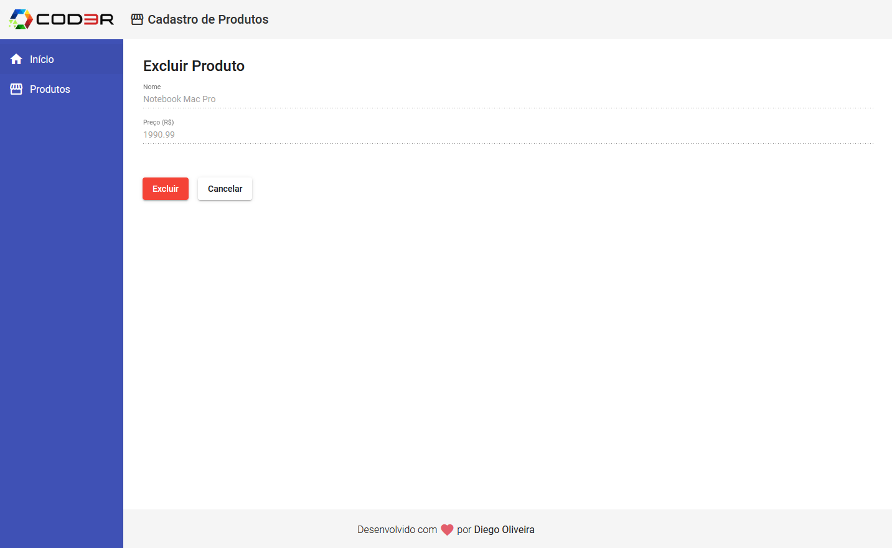

# CRUD em Angular

## ℹ️ Sobre o projeto

Mantido pela gigante da tecnologia Google, o Angular 9 é um dos principais frameworks frontend do mercado!

Nesse projeto desenvolvi um sistema de cadastro de produtos, onde temos as quatro operações básicas de Um Crud(Create, Read, Update, Delete)

## ✨ demonstração

</br>




</br>
</br>

## 🎯 Objetivo do projeto

Foi realizado este projeto com o intuito de adquerir conhecimentos sobre o framework Angular.

## 📝 Tecnologias

Para a realização desse projeto foi utilizado as seguintes tecnologias/linguagens:

- [Angular](https://angular.io/) Angular is a platform for building mobile and desktop web applications
- [Angular Material UI](https://material.angular.io/) Internationalized and accessible components for everyone
- [TypeScript](https://www.typescriptlang.org/) Typed JavaScript at Any Scale.

## ⚙️ Instalação

Para que este rode em sua máquina, siga os passos abaixo:

```bash
# Clone o repositório em alguma pasta em sua máquina
$ git clone git@github.com:Diegooliveyra/CRUD-Angular.git

# Entre no repositório
$ cd crud-angular

Instale as dependencias digitando no termimal:
$ npm install

Rode a aplicação no modo de desenvolvimento.
$ npm start

Abra http://localhost:4200 no seu navegador para visualizar o projeto
```

## 📝 Licença

<p>O projeto se encontra sob licença MIT. Para mais detalhes, acesse <a href='LICENSE'>license<a>.</p>
<p>Criado com 💙 por <a href='https://github.com/Diegooliveyra/' target='blank'>Diego Oliveira</a></p>
